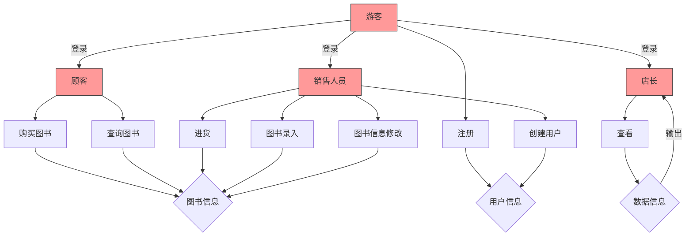
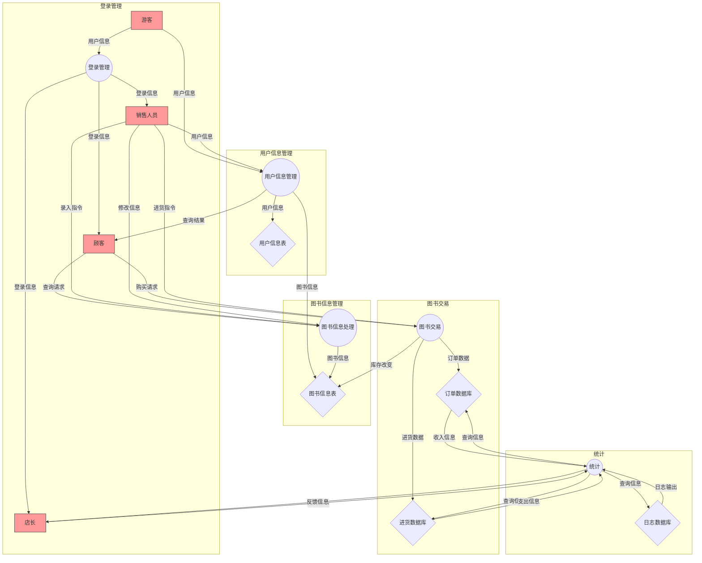

# 需求分析

## 1. 业务流图

销售人员拥有顾客的权限；店长具有系统最高权限，可以执行所有顾客和销售人员的业务。



## 2. 数据流图

可以将Bookstore系统内的主要流程拆分为以下流程：

- P1.登录管理（系统）
- P2.用户信息管理（顾客、销售人员）
- P3.图书交易（顾客、销售人员）
- P4.图书信息管理（顾客、销售人员）
- P5.统计（店长）

数据储存有：

- D1.用户信息表
- D2.图书信息表
- D3.订单数据库
- D4.进货数据库
- D5.日志数据库



## 3. 数据词典

### 数据项

| 数据项名称           | 类型  | 长度    | 含义       |
|-----------------|-----|-------|----------|
| ISBN            | 字符串 | <= 20 | 图书的唯一标识符 |
| title           | 字符串 | <= 60 | 书名       |
| author          | 字符串 | <= 60 | 作者 |
| keyword_list    | 字符串 | <= 60 | 原始关键词字符串 |
| price           | 浮点数 | ——    | 图书单价 |
| import_price    | 浮点数 | —— | 图书进货价格 |
| quantity        | 整型  | —— | 库存量 |
| buy_quantity    | 整型 | —— | 购买本数 |
| keyword         | 字符串 | <= 60 | 单个关键词 |
| ISBN_list       | 字符串 | —— | 与某冠词关联的一组ISBN |
| username        | 字符串 | <= 30 | 用户名 |
| password        | 字符串 | <= 30 | 密码 |
| usertype        | 整数  | —— | 0游客 / 1顾客 / 2销售人员 / 3店长|
| time_stamp      | 字符串 | —— | 操作时间 |
| quantity_change | 整型  | —— | 图书库存量变化 |
| operation_type  | 字符串 | —— | 操作类型（例如login/buy）|
| revenue         | 浮点数 | —— | 收入 |
| expense         | 浮点数 | —— | 支出 |

## 4. 功能说明

### 4.1 登录管理模块

- 功能1：登录
  - 输入：用户名、密码
  - 输出：成功/失败状态、当前用户
- 功能2：注销
  - 输入：操作类型
  - 输出：成功/失败状态、当前用户

### 4.2 用户信息管理模块

- 功能1：游客注册
  - 输入：用户名、密码
  - 输出：成功/失败状态、错误类型
- 功能2：创建用户
  - 输入：用户名、密码、权限
  - 输出：成功/失败状态、错误类型

### 4.3 图书交易模块

- 功能1：购买图书
  - 输入：ISBN、数量
  - 输出：成功/失败状态（错误类型）、总价格
  - 系统行为（若成功）：
    - 图书库存量减少
    - 生成订单记录
- 功能2：进货
  - 输入：ISBN、数量、进货价格
  - 输出：成功/失败状态（错误类型）
  - 系统行为（若成功）：
    - 图书库存量增加
    - 生成进货记录

### 4.4 图书信息管理模块

- 功能1：图书查询
  - 输入：ISBN、书名、作者、关键字的任意字段组合
  - 输出：符合要求的图书列表
- 功能2：图书录入
  - 输入：完整图书信息
  - 输出：成功/失败状态
- 功能3：图书信息修改
  - 输入：ISBN和修改字段
  - 输出：成功/失败状态

### 4.5 统计模块

- 功能1：查询采购情况
  - 输入：时间范围
  - 输出：ISBN、数量、进货价、时间
- 功能2：查询销售情况
  - 输入：时间范围
  - 输出：ISBN、数量、单价、时间
- 功能3：查询盈利情况
  - 输入：时间范围
  - 输出：收入、支出、利润
- 功能4：查看员工工作情况报告
  - 输入：用户名 | 全部
  - 输出：操作类型、操作对象、参数、时间
- 功能5：查看系统整体日志
  - 输入：时间范围
  - 输出：日志列表

## 5. 用户交互设计

### 5.0 通用命令

#### 5.0.1 帮助
````
help # 列出现有的所有权限
````
输出（示例）：
````
Available commands:
register <username> <password>
login <username> <password>
logout
whoami
help
……
````

#### 5.0.2 报错

当当前用户没有输入指令对应的操作权限时，输出：
````
<operation_type> failed: insufficient privileges. # 失败.权限不足
````

#### 5.0.3 退出
````
exit #退出程序
````
输出： 
````
Exiting system.
````

#### 5.0.4 显示当前用户
````
whoami
````
输出：
````
Current user: <username> (<usertype>)
Login stack: [<username> (<usertype>)]
````

#### 5.0.5 登录
````
login <username> <password> # 任何用户都可执行登录指令
````
三种输出：
````
Login success. Current user: <username> (<usertype>). # 成功登录
Login failed: wrong password. # 失败.密码错误
Login failed: invalid username. #失败.用户名不存在
````

#### 5.0.6 注销
````
logout
````
两种输出：
````
Logout success. Current user: <username> (<usertype>). # 成功注销
Logout failed: no user logged in. # 失败.登录栈已空
````

#### 5.0.7 注册
````
register <username> <password> # 游客注册
````
两种输出：
````
Register success. Username: <username> Role: customer # 成功注册顾客账号
Register failed: username already exists. # 失败.用户名已存在
````

### 5.1 顾客/销售人员/店长指令

#### 5.1.1 查询图书
````
search [--isbn <ISBN>] [--title "<title-substr>"] [--author "<author-substr>"] [--keyword "<kw1 kw2 ...>"] #任意字段组合查询
````
成功输出：
````
Search results: <n> records found. # 成功找到n本符合条件的图书
1) ISBN: <ISBN>
   Title: <title>
   Author: <author>
   Keywords: <keyword>
   Price: <price>
   Stock: <quantity>

···
````
无结果输出：
````
Search results: 0 records found. #失败.未找到符合条件的图书
````

#### 5.1.2 购买图书
````
buy <ISBN> <buy_quantity>
````
三种输出：
````
Purchase success.Total price is <total_price>. # 成功.总价为单价*购买本数
Purchase failed: insufficient stock. # 失败.库存不足
Purchase failed: ISBN not found. # 失败.未找到此书
````

### 5.2 销售人员/店长指令

#### 5.2.1 进货
````
import <ISBN> <quantity> <import_price>
````
两种输出：
````
Import success. # 成功
Import failed: ISBN not found. Please add book first. # 失败.ISBN不存在
````

#### 5.2.2 录入图书
````
addbook <ISBN> <title> <author> "<keyword_list>" <price> <quantity>
````
两种输出：
````
AddBook success. # 成功录入
AddBook failed: ISBN already exists. # 失败.该isbn已存在
````

#### 5.2.3 修改图书信息
````
modify <ISBN> [--title "<new_title>"] [--author "<new_author>"] [--keyword "<new_keywords>"] [--price <new_price>]
````
两种输出：
````
Modify success. # 成功修改
Modify failed: ISBN not found. # 失败.没有找到该书
````
#### 5.2.4 创建用户
````
create-user <username> <password> <role> # 销售人员可以创建顾客或销售用户，此外店长有权创建店长用户
````
两种输出：
````
Create-user success. Username: <username> Role: <usertype> # 成功创建账号
Register failed: username already exists. # 失败.用户名已存在
````

### 5.3 店长指令

#### 5.3.1 查询进货记录
````
show-imports [--from YYYY-MM-DD] [--to YYYY-MM-DD]
````
输出（示例）：
````
Import records from YYYY-MM-DD to YYYY-MM-DD:
1) Time: YYYY-MM-DD HH:MM:SS  ISBN:<ISBN>  Quantity:<quantity>  Price:<import_price>  Operator:<username>
...
````

#### 5.3.2 查询销售记录
````
show-sales [--from YYYY-MM-DD] [--to YYYY-MM-DD]
````
输出（示例）：
````
Sales records from YYYY-MM-DD to YYYY-MM-DD:
1) Time: YYYY-MM-DD HH:MM:SS  ISBN:<ISBN>  Quantity:<buy_quantity>  Price:<price>  Operator:<username>
...
````

#### 5.3.3 查询盈利情况
````
show-profit [--from YYYY-MM-DD] [--to YYYY-MM-DD]
````
输出：
````
Profit record from YYYY-MM-DD to YYYY-MM-DD:
Total Sales Revenue: <revenue>
Total Import Expense: <expense>
Profit: <profit>
````

#### 5.3.2 查看员工工作情况报告
````
show-staff-log <username> [--from YYYY-MM-DD] [--to YYYY-MM-DD] 
````
输出（示例）：
````
Operation log for <username>:
1) YYYY-MM-DD HH:MM:SS  <operation>  ···  result: success
...
````

#### 5.3.3 查看系统整体工作日志
````
show-log <username> [--from YYYY-MM-DD] [--to YYYY-MM-DD] 
````
输出（示例）：
````
System log:
1) YYYY-MM-DD HH:MM:SS  <username> <operation>  ···  result: success
...
````
